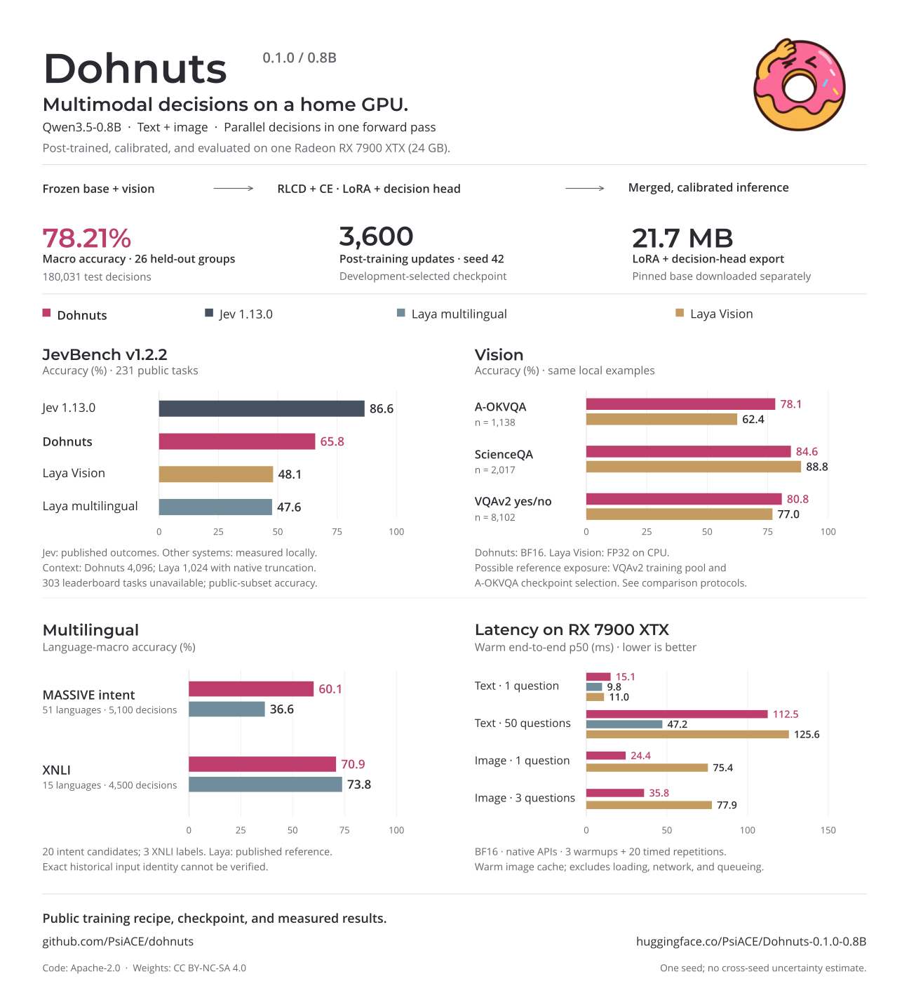

# Dohnuts-0.1.0-0.8B

A multimodal decision model built on Qwen3.5-0.8B. It scores supplied candidates
from text and images, returning candidate probabilities, truth estimates, or
ordered scores. Independent questions about one input share computation in a
single forward pass. The interface returns decisions without generating reasoning
or free-form answers.

## Model details

| Property | Value |
| --- | --- |
| Base model | Qwen/Qwen3.5-0.8B |
| Training | Joint RLCD and auxiliary cross-entropy; language LoRA and a candidate scorer |
| Selection | Seed 42, update 3,600; highest development macro accuracy |
| Calibration | One temperature per decision type, fitted on an independent partition |
| Runtime | Merged LoRA, BF16, fused operations, shared input prefixes |
| Inputs | Text and one decoded image; 2–128 candidates per question |
| Context | 4,096 tokens per question at inference; 2,048 during training |
| Hardware used | One AMD Radeon RX 7900 XTX, 24 GB |

## Use

Dohnuts is intended for tasks with explicit candidate answers: routing requests,
classifying content, estimating whether a condition holds, rating relevance, or
answering visual questions. An application supplies the choices and decides how
to act on the returned probabilities.

After [setting up the runtime](docs/inference.md), load the model from Hugging Face:

```python
from linnaeus.predictor import Predictor

model = Predictor.from_checkpoint("PsiACE/Dohnuts-0.1.0-0.8B")
```

The compact checkpoint contains LoRA and scorer weights. The loader downloads
and caches it with the pinned base model, merges LoRA, and applies calibration.
Weights are not bundled with the Python package. See the [inference guide](docs/inference.md) for question
definitions, images, and response fields, or [Bub integration](docs/bub-agent.md)
for agent use.

## Evaluation



The model achieves **78.21% macro accuracy** over 26 held-out dataset groups
containing 180,031 decisions. Each group contributes equally to this mean.
Development data selects weights; calibration data fits temperatures; test data
does neither. This is one training seed, with no estimate of variation across seeds.

### JevBench

Accuracy on the same 231 public tasks from JevBench v1.2.2:

| Model | Correct | Accuracy |
| --- | ---: | ---: |
| Dohnuts-0.1.0-0.8B | 152 / 231 | 65.80% |
| Jev 1.13.0 | 200 / 231 | 86.58% |
| Laya multilingual | 110 / 231 | 47.62% |
| Laya Vision | 111 / 231 | 48.05% |

Jev results use published per-task outcomes; Dohnuts and the two Laya checkpoints
were measured locally. Dohnuts uses a 4,096-token limit; the Laya runs use their
native 1,024-token limit and truncation. The other 303 leaderboard tasks are
unavailable, including the judge tier. These accuracies are not the official
four-axis leaderboard score.

### Laya task suites

Dohnuts leads the published Laya multilingual reference on the 51-language
MASSIVE intent suite, at **60.14%** versus **36.61%** language macro accuracy.
Laya multilingual leads on the 15-language XNLI suite, at **73.84%** versus
**70.91%**. The upstream question builders are preserved, but the historical
reference's input hashes are unavailable, so exact input identity cannot be verified.

Against Laya Vision on the same local image examples, Dohnuts scores higher on
A-OKVQA and VQAv2 yes/no; Laya Vision scores higher on ScienceQA and has lower
calibration error on ScienceQA and VQAv2. These runs use different precision and
have reference data-exposure limitations, documented in the
[comparison protocols](docs/upstream-alignment.md).

The [comparison gallery](docs/figures/README.md) includes every application suite,
language results, vision accuracy and calibration, and paired JevBench outcomes.

### Inference speed

Warm end-to-end median latency on one RX 7900 XTX, using BF16 and each model's
native API:

| Workload | Dohnuts | Laya multilingual | Laya Vision |
| --- | ---: | ---: | ---: |
| Text, 1 question | 15.07 ms | 9.77 ms | 11.00 ms |
| Text, 50 questions | 112.51 ms | 47.19 ms | 125.63 ms |
| Image, 1 question | 24.43 ms | — | 75.41 ms |
| Image, 3 questions | 35.84 ms | — | 77.89 ms |

Measurements use three warmups and 20 synchronized repetitions, including
preprocessing and transfers. They exclude model loading, network, and queueing.
Image timings use warm caches. They do not measure uncached image encoding or
service throughput under load. See the [full charts](docs/figures/README.md#same-hardware-inference-latency)
and [benchmark protocol](docs/local-benchmarks.md).

## Training

The mixture covers 26 text, language, and vision task groups, including public
classification, question-answering, retrieval, policy, mail, and visual datasets.
A fixed cap provides 143,238 eligible training rows; sampling is uniform over
groups with replacement. The 3,600 updates process 115,200 sampled examples.
Related documents and identical images are grouped to prevent cross-split leakage.
Dataset sources, exclusions, and terms are listed in the
[data reference](docs/data-and-evaluation.md).

The base model and vision encoder are frozen. Training updates rank-8 language
LoRA adapters and a shared candidate scorer. The joint RLCD and cross-entropy
objective follows the pinned Laya and Laya Vision implementations. Its four
samples perturb decision logits; they are not generated trajectories. LoRA is
merged before temperature fitting and final evaluation. The
[RLCD specification](docs/rlcd.md) gives the objective and fixed schedule.

### Training datasets

The 26 training groups are derived from the following source datasets. Hub links
identify the datasets; the [download manifests](https://github.com/PsiACE/dohnuts/tree/main/data/manifests) pin the files,
revisions, and checksums actually used, including official archives downloaded
outside the Hub.

| Task family | Sources |
| --- | --- |
| Intent and topic classification | [MASSIVE 1.1](https://huggingface.co/datasets/AmazonScience/massive) (en-US, zh-CN), [AG News](https://huggingface.co/datasets/fancyzhx/ag_news), [BANKING77](https://huggingface.co/datasets/PolyAI/banking77) |
| Entailment, emotion, and Boolean QA | [XNLI](https://huggingface.co/datasets/facebook/xnli) (en, zh), [emotion](https://huggingface.co/datasets/dair-ai/emotion), [BoolQ](https://huggingface.co/datasets/google/boolq) (SuperGLUE distribution) |
| Visual decisions | [CLEVR 1.0](https://cs.stanford.edu/people/jcjohns/clevr/), [A-OKVQA](https://huggingface.co/datasets/HuggingFaceM4/A-OKVQA), [ScienceQA](https://huggingface.co/datasets/derek-thomas/ScienceQA) (image subset), [VQAv2](https://huggingface.co/datasets/lmms-lab-encoder/VQAv2) (yes/no) |
| Screen region decisions | [ScreenQA](https://github.com/google-research-datasets/screen_qa), with [Rico](https://www.interactionmining.org/archive/rico) screenshots and view hierarchies |
| Typed decisions | [LocalLLaMA/typed-decisions](https://huggingface.co/datasets/LocalLLaMA/typed-decisions), using public soft teacher distributions |
| Retrieval and relevance | [Amazon ESCI](https://github.com/amazon-science/esci-data) (en, es, ja), [WikiQA](https://huggingface.co/datasets/microsoft/wiki_qa) |
| Policy and contract decisions | [ShARC](https://huggingface.co/datasets/UCLNLP/sharc), [ContractNLI](https://stanfordnlp.github.io/contract-nli/) |
| Spam and phishing | [SpamAssassin](https://spamassassin.apache.org/old/publiccorpus/), [Nazario phishing corpus](https://monkey.org/~jose/phishing/), [UCI SMS Spam Collection](https://huggingface.co/datasets/ucirvine/sms_spam) |

JevBench tasks and the frozen Laya benchmark inputs are evaluation-only.
The [data protocol](docs/data-and-evaluation.md) describes source-specific
conversions, grouped partitions, exclusions, and terms.

## Limitations

- Quality depends on the task. Jev leads on the public JevBench tasks; Laya
  multilingual leads on several application suites and small text-batch latency.
- Global temperatures do not improve every dataset's calibration. The API's
  `confidence` field summarizes a distribution; it is not a measured probability
  of correctness. Check calibration on the intended workload.
- Candidate wording, order, and input length can affect decisions. Over-budget
  inputs are rejected. A long-document result covers only the eligible subset.
- Laya Vision has possible VQAv2 training-pool exposure and A-OKVQA selection
  exposure. Backbone pretraining exposure is unverified. These comparisons do
  not establish performance on unseen data for every reference.
- Bub acceptance exercises the decision tool. It does not measure autonomous
  planning quality.

## Artifact and provenance

Base revision: `2fc06364715b967f1860aea9cf38778875588b17`.

Selected weight SHA-256:
`196be33a0282537bcd821e2115643b352d0ad2a0bbaf7b242a1b7fe5bd96cfdf`.

The exported checkpoint records calibration, selection, and partition hashes in
`linnaeus.json`. The [results](results/README.md) include loss, development accuracy,
held-out quality, calibration bins, latency samples, and resource measurements.
Their manifest identifies the selected weights and checksums each published table.
No training Git revision was recorded. [Chart values](docs/figures/chart-data.csv)
and a [figure manifest](docs/figures/manifest.json) accompany the comparisons.

## License

The code is licensed under [Apache-2.0](LICENSE). The decision weights are provided
under [CC BY-NC-SA 4.0](https://huggingface.co/PsiACE/Dohnuts-0.1.0-0.8B/blob/main/LICENSE)
for non-commercial research. This grant covers the Dohnuts LoRA and decision-head
contributions; the base model and source data retain their own terms.

The Qwen3.5-0.8B base is Apache-2.0. [ScienceQA's dataset terms](https://github.com/lupantech/ScienceQA#warning-licenses)
include non-commercial and share-alike restrictions; other sources have their
own research-use terms.
The checkpoint is not offered as a commercially cleared model. See the
[data reference](docs/data-and-evaluation.md#release-assets-and-terms) and
[attributions](NOTICE).

```{toctree}
:hidden:

Benchmark comparisons <docs/figures/README>
Evaluation results <results/README>
```
