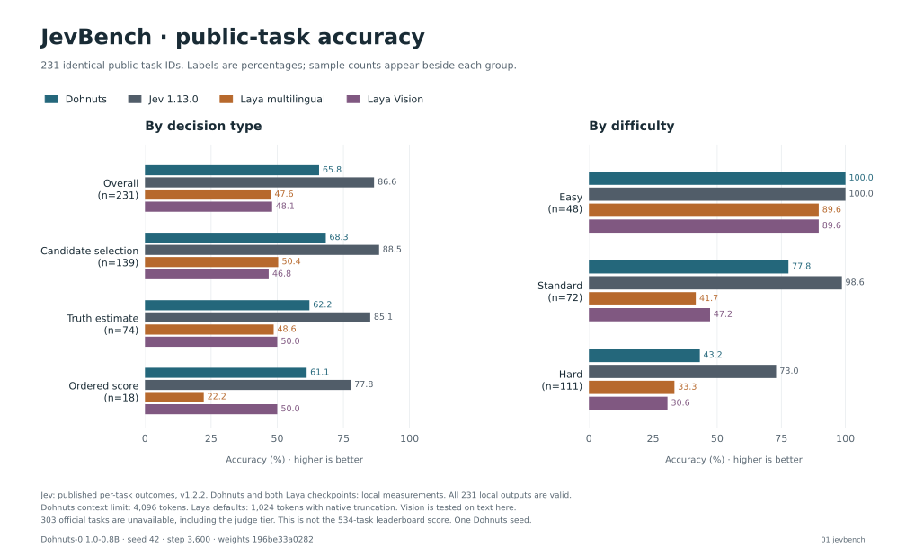
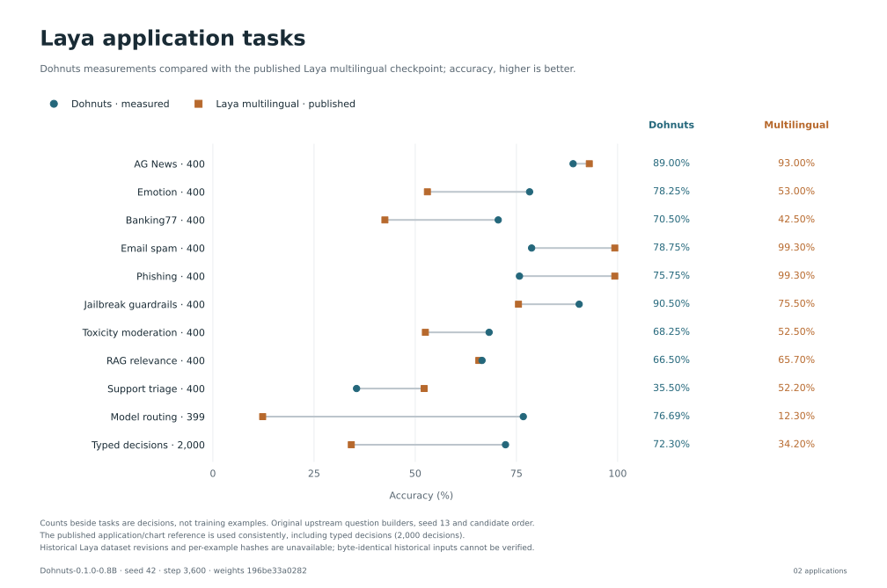
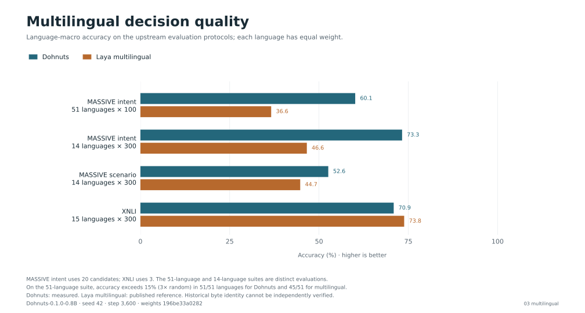
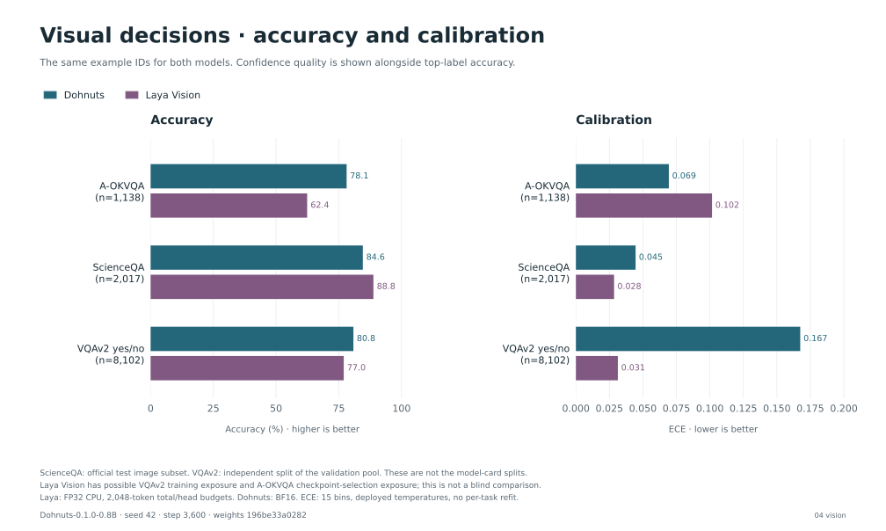
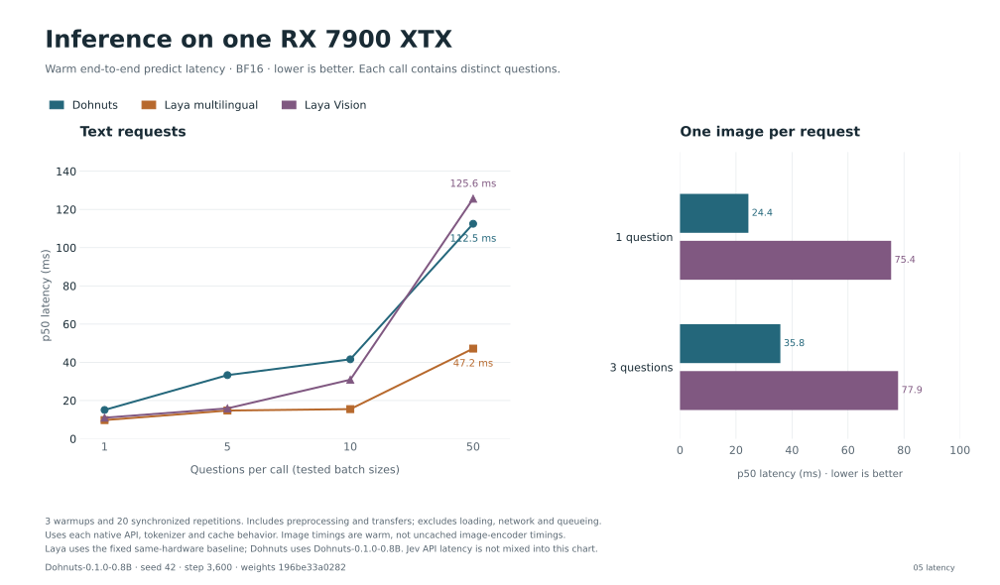
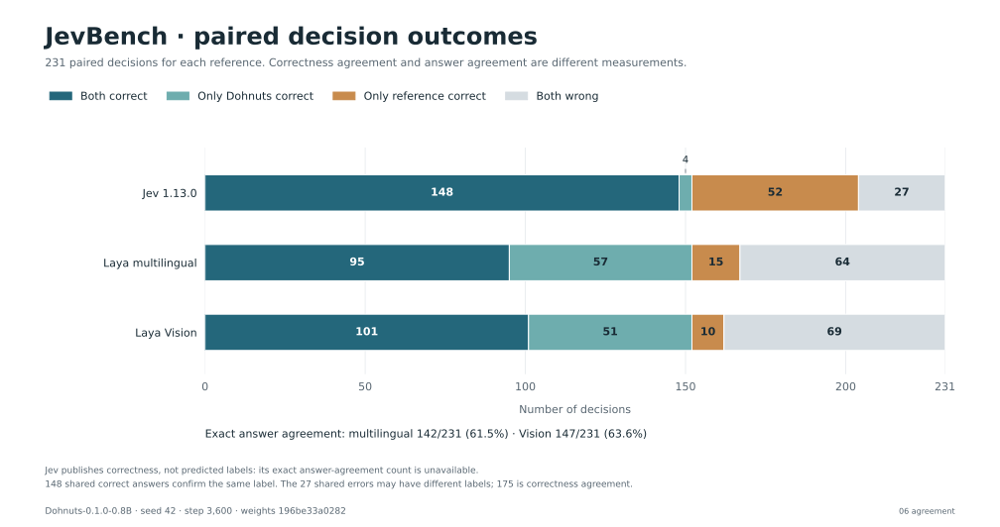

# Dohnuts-0.1.0-0.8B comparisons

Seed 42, update 3,600. Figures use saved evaluation results with fixed Laya multilingual and Laya Vision references.

[Model overview](overview.svg) · [Chart data](chart-data.csv) · [Model identity and checksums](manifest.json)

The figures are available as SVG. Captions document each evaluation protocol. One seed does not provide confidence intervals across seeds.

## JevBench: decision types and difficulty



- Jev: published per-task outcomes, v1.2.2. Dohnuts and both Laya checkpoints: local measurements. All 231 local outputs are valid.
- Dohnuts context limit: 4,096 tokens. Laya defaults: 1,024 tokens with native truncation. Vision is tested on text here.
- 303 official tasks are unavailable, including the judge tier. This is not the 534-task leaderboard score. One Dohnuts seed.

## Laya multilingual: application tasks



- Counts beside tasks are decisions, not training examples. Original upstream question builders, seed 13 and candidate order.
- The published application/chart reference is used consistently, including typed decisions (2,000 decisions).
- Historical Laya dataset revisions and per-example hashes are unavailable; byte-identical historical inputs cannot be verified.

## Laya multilingual: language coverage and accuracy



- MASSIVE intent uses 20 candidates; XNLI uses 3. The 51-language and 14-language suites are distinct evaluations.
- On the 51-language suite, accuracy exceeds 15% (3× random) in 51/51 languages for Dohnuts and 45/51 for multilingual.
- Dohnuts: measured. Laya multilingual: published reference. Historical byte identity cannot be independently verified.

## Laya Vision: accuracy and calibration



- ScienceQA: official test image subset. VQAv2: independent split of the validation pool. These are not the model-card splits.
- Laya Vision has possible VQAv2 training exposure and A-OKVQA checkpoint-selection exposure; this is not a blind comparison.
- Laya: FP32 CPU, 2,048-token total/head budgets. Dohnuts: BF16. ECE: 15 bins, deployed temperatures, no per-task refit.

## Same-hardware inference latency



- 3 warmups and 20 synchronized repetitions. Includes preprocessing and transfers; excludes loading, network and queueing.
- Uses each native API, tokenizer and cache behavior. Image timings are warm, not uncached image-encoder timings.
- Laya uses the fixed same-hardware baseline; Dohnuts uses Dohnuts-0.1.0-0.8B. Jev API latency is not mixed into this chart.

## JevBench: paired correctness and answer agreement



- Jev publishes correctness, not predicted labels: its exact answer-agreement count is unavailable.
- 148 shared correct answers confirm the same label. The 27 shared errors may have different labels; 175 is correctness agreement.

## Reproduce the figures

Follow the [plotting setup](../local-benchmarks.md#model-card-figures), then run from the repository root:

```sh
uv run python scripts/plot_model_card.py --run runs/v1
```

The command writes PNG, SVG, and PDF figures to the experiment output directory.
The published manifest identifies the model and checksums the figures and chart values.
